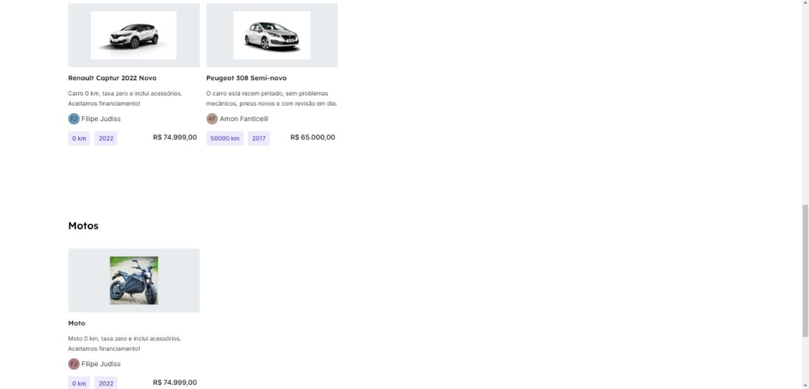
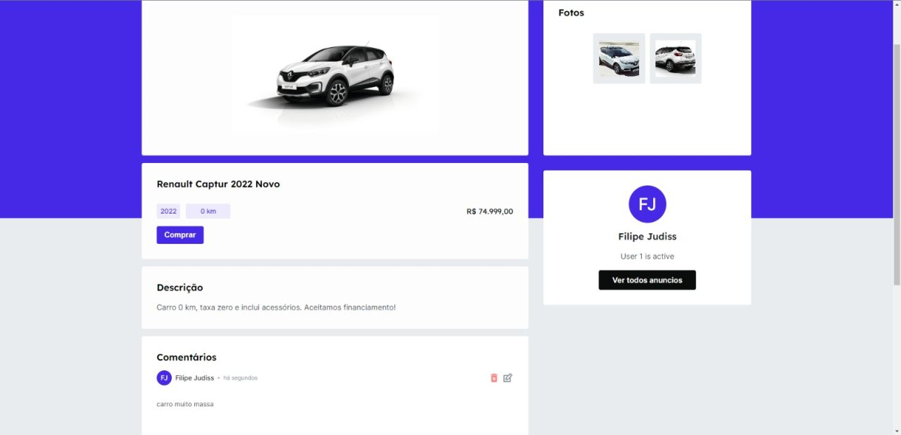

# Car Auction

A front-end platform for buying and selling cars and motorcycles, built as the client interface for the [Car Auction API](https://github.com/amonfanticelli/car-auction-back-end).





## Technologies

- React
- TypeScript
- Styled Components
- Axios
- React Hook Form
- Yup
- React Router DOM
- UUID

## Features

- User registration as buyer or announcer
- Vehicle listing with image gallery
- Search and filter announcements
- Announcer profile page
- Protected routes via JWT token

## Getting Started

This is a full-stack project. The backend must be running before starting the frontend. See the [Car Auction API repository](https://github.com/amonfanticelli/car-auction-back-end) for setup instructions.

1. Clone the repository and create your `.env` file:

2. Fill in the `.env` variables:

```dotenv
VITE_API_URL=http://localhost:3000
```

3. Install dependencies and start the application:

```bash
yarn install
yarn dev
```

The application will be available at `http://localhost:5173`.

## Team

- Amon Fanticelli Moreira Rangel
- Filipe Judiss Albuquerque
- Lucas Vale